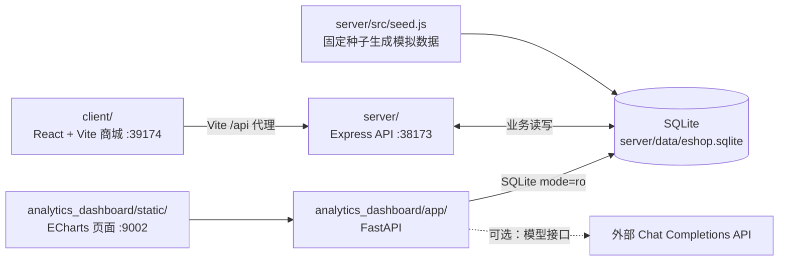

# EShop Intelligence Dashboard

基于模拟商城数据的电商经营分析与决策演示项目。它把 React 商城、Express 交易 API、SQLite 课程数据集和 FastAPI 分析仪表盘放在同一仓库，用可复现的模拟数据展示指标计算、用户分析、商品关联、销售趋势和运营建议。

> 项目背景：课程团队基于教师提供的模拟商城与 `course_dataset_v2` 场景开展分析。商城交易流程和课程数据集是教学基础设施；本仓库的分析重点是指标口径、经营诊断、可视化和决策支持。所有业务数据均为模拟生成，结论只用于教学演示。

## 目录

- [项目功能](#项目功能)
- [系统架构与技术栈](#系统架构与技术栈)
- [指标口径](#指标口径)
- [分析模块与方法](#分析模块与方法)
- [快速开始](#快速开始)
- [验证与部署](#验证与部署)
- [项目结构](#项目结构)
- [设计取舍、局限与改进](#设计取舍局限与改进)
- [数据与使用说明](#数据与使用说明)

## 项目功能

| 部分 | 已实现内容 |
| --- | --- |
| 模拟商城 | React 页面提供商品浏览、搜索、购物车、模拟下单与订单历史；Express API 处理用户、商品和交易数据。注册能力位于后端 API。 |
| 经营仪表盘 | 11 个导航页面展示经营总览、数据概览、漏斗、客户、商品、预测、营销、综合诊断、履约售后、AI 助手和配置。 |
| 分析子项目 | 9 个 Python 模块计算 KPI、RFM、复购倾向规则分数、客户分群、两两商品关联、销售趋势、渠道效率、履约售后和综合建议。 |
| AI 分析助手 | 默认使用本地关键词与模板生成摘要；配置兼容 Chat Completions 的模型接口后可调用外部服务。 |

这里的“预测”“归因”和“ROI”沿用页面/接口中的名称；其实际计算方法与适用边界见[分析模块与方法](#分析模块与方法)和[分析方法与指标口径](docs/analysis-methodology.md)。

## 系统架构与技术栈



`server/src/db.js` 定义 20 张业务表和 14 个 SQLite 分析视图（`dim_*`、`fact_*`、`daily_business_summary`）。视图直接查询源表，仓库没有独立的批处理 ETL 任务；FastAPI 通过只读连接使用这些视图。分析结果缓存 300 秒，可调用 `POST /api/reload` 强制重算。数据流及视图粒度见[源表与分析视图映射](docs/source-to-dataset-mapping.md)。

| 层次 | 实际技术 |
| --- | --- |
| 商城前端 | React、Vite 5、原生 CSS |
| 交易 API 与数据生成 | Node.js（仓库要求 `>=20 <24`）、Express、better-sqlite3 |
| 分析 API | Python `>=3.10`、FastAPI、Uvicorn |
| 可视化 | 原生 JavaScript、ECharts 5.5.0（通过 CDN 加载） |
| 数据与部署 | SQLite 3、Docker Compose（仅 API 与仪表盘） |

## 指标口径

经营总览基于 `fact_order`，其 `order_date` 来自订单的 `created_at`，因此按**订单创建日**归期，不按支付日归期。

| 指标 | 当前实现 |
| --- | --- |
| GMV | `status IN ('paid', 'completed')` 的 `SUM(paid_amount)`；未扣退款。 |
| 付费订单数 / 买家数 | 同一状态条件下，分别按 `order_id` / `user_id` 去重。 |
| 客单价 / 客均消费 | `GMV / 付费订单数`；`GMV / 付费买家数`。分母为 0 时返回 0。 |
| 退款订单率 / 退款金额率 | 全部 `approved` 退款的去重订单数 / 付费订单数；全部 `approved` 退款金额 / GMV。退款分子包含已转为 `refunded` 等状态的订单，分母只含 `paid/completed` 订单，解读时需注意。 |
| 漏斗阶段与比率 | 每种事件分别统计去重 `session_id`，相邻阶段计数相除；没有校验同一会话按顺序经过全部阶段。 |
| 渠道 ROAS | 按已有订单 `channel` 汇总的 GMV / 同渠道广告消耗；这是渠道汇总效率指标，未做触点级或因果归因。 |

其他指标的表、字段、粒度、过滤条件及方法限制见[分析方法与指标口径](docs/analysis-methodology.md)；完整表/视图列表见[数据字典](docs/data-dictionary.md)。

## 分析模块与方法

| 模块 | 输入与方法 | 输出及边界 |
| --- | --- | --- |
| `business_health` | 付费订单聚合、月度/渠道拆解、按事件独立去重的会话漏斗 | GMV、客单价、退款率和漏斗比率；属于描述性诊断。 |
| `feature_engineering` | 以数据中最后一个付费订单日期为基准构建 RFM，并按排序分为五档；按首次付费月份计算 Cohort 矩阵 | 用户特征、RFM 标签与按月再次购买率。 |
| `repurchase_prediction` | R/F/M/近 30 天购买趋势加权规则评分，权重 0.30/0.25/0.25/0.20，阈值 60 | 高倾向名单；没有训练分类器，也没有用真实复购标签验证准确率。 |
| `customer_clustering` | RFM 五档分数与条件规则 | 运营客群和建议；没有运行 K-Means。 |
| `association_rules` | 最多抽取按订单 ID 倒序排列的 20,000 个有明细订单，仅用至少 2 个不同 SKU 的购物篮计算两两共现 | 支持度、置信度、提升度和前 20 条规则；不挖掘三件及以上商品组合。 |
| `sales_forecast` | 最近最多 30 个**有付费订单的日期**拟合线性趋势，滚动一步回测 | 未来 7/30 期日 GMV、MAE/MAPE/RMSE、近似波动范围；缺失日期未补零，且不足 31 个观测日时回测误差为 0 表示未回测，不能视为可靠库存预测。 |
| `marketing_attribution` | 按订单与广告表中已有的 `channel` 汇总，计算 CTR、CVR、CPA、ROAS | 渠道效率和阈值式预算建议；没有用户级触点链或增量实验。 |
| `fulfillment_analysis` | 包裹时效、退款原因、评论与商品售后汇总 | 延迟率、退款及评价分布。 |
| `decision_board` | 汇总上述模块并应用阈值规则 | 优先级建议；建议收益需在实际业务中验证。 |

复购模块返回的 `estimated_roi` 使用“平均客单价 × 假设转化率 15% ÷ 假设触达成本 5 元/人”。它是**情景收益/成本倍数**，不是已经观测到的营销 ROI。销售模块的 `safety_stock_gmv` 为 `1.5 × 近 30 期日 GMV 标准差`，单位是金额，不是 SKU 库存件数。

## 快速开始

### 环境准备

需要 Node.js `>=20 <24`、npm `>=9`、Python `>=3.10`，以及可用的 `pip`。以下命令在仓库根目录执行：

```bash
git clone https://github.com/XDforever-lab/dashboard.git
cd dashboard
npm run install:all
```

`install:all` 会安装服务端、商城前端和 Python 分析依赖。图表脚本通过 CDN 加载，离线使用需自行提供该资源。

### 生成数据并启动

仓库**不包含** `server/data/eshop.sqlite`。首次运行先生成课程数据：

```bash
npm run seed --prefix server
```

**注意：再次执行 seed 会删除并重建本地 SQLite 数据库，包括商城中新增的订单和交互记录。** 需要保留数据时先备份 `server/data/`。

在终端 A 启动 Express API 与分析仪表盘：

```bash
npm run dev
```

如需体验商城，在终端 B 单独启动 React 前端：

```bash
npm run start:mall-web
```

| 入口 | 地址 | 启动来源 |
| --- | --- | --- |
| 分析仪表盘 | `http://localhost:9002/` | `npm run dev` |
| Express API | `http://localhost:38173/api/health` | `npm run dev` |
| React 商城 | `http://localhost:39174/` | `npm run start:mall-web` |

访问 `http://localhost:9002/health` 时，确认 `database: connected`（表示数据库文件存在），再访问 `http://localhost:9002/api/summary` 验证查询可用。`status: ok` 单独出现并不能证明数据库已就绪。

### AI 助手配置（可选）

未配置 `DASHBOARD_AI_ENDPOINT` 时使用本地关键词/模板回答；配置了 endpoint 后会尝试外部调用，失败时回退本地。若需调用兼容 Chat Completions 的模型服务，将 `analytics_dashboard/.env.example` 复制为 `analytics_dashboard/.env`，填写：

```dotenv
DASHBOARD_AI_ENDPOINT=https://example.com/v1/chat/completions
DASHBOARD_AI_API_KEY=your-api-key
DASHBOARD_AI_MODEL=your-model
```

密钥仅放在本地环境配置中；不要提交到仓库。外部模型产生的文字建议也应以实际指标和实验结果复核。

## 验证与部署

```bash
npm run test:analytics  # 指标与分析逻辑单元测试
npm run build:mall-web  # 商城前端构建
npm run verify          # 上述两项
npm run test:dashboard  # API 冒烟测试：需要先生成 SQLite 数据
```

常用分析接口包括 `GET /api/summary`、`GET /api/subprojects`、`GET /api/subprojects/{id}`、`GET /api/decision-board` 和 `POST /api/reload`；FastAPI 的交互式接口文档位于 `http://localhost:9002/docs`。

Docker Compose 仅运行 `mall-api`（38173）和 `dashboard`（9002），不包含商城前端。首次使用可在宿主机完成 `npm run install:all` 与 seed 后执行 `docker compose up --build`；也可按 [Ubuntu Docker Compose 指南](docs/ubuntu-docker-compose-guide.md)使用容器生成数据。两个容器共享 `./server/data` 挂载目录。

## 项目结构

```text
dashboard/
├── client/                       React 商城与 Vite 代理
│   └── src/main.jsx
├── server/                       Express API、SQLite schema、模拟数据生成
│   └── src/{server,db,seed}.js
├── analytics_dashboard/
│   ├── app/main.py               FastAPI 入口、缓存与 AI 助手
│   ├── app/data_access.py        SQLite 只读访问
│   ├── app/subprojects/          9 个分析模块
│   ├── static/                   仪表盘页面、样式与 ECharts 逻辑
│   └── tests/                    单元与冒烟测试
├── docs/                         数据字典、方法口径、课程与部署说明
├── scripts/dev.mjs               本地启动 API 与仪表盘
├── docker-compose.yml
└── README.md
```

## 设计取舍、局限与改进

- **可复现的课程数据**：固定随机种子 `20260427` 使相同配置下的模拟数据可重建；它不能代表真实用户行为或证明建议在真实业务中有效。
- **单文件数据库与实时视图**：SQLite 和 `CREATE VIEW` 便于本地运行与追溯指标来源，但不覆盖高并发、数据治理或生产级 ETL 的需求。
- **可解释的基线方法**：RFM 规则、两两共现和线性趋势易于检查；当前没有复购分类器的离线标签评估、严格漏斗路径分析、完整多商品项集、季节性预测或营销增量评估。
- **口径与新交易限制**：退款分子分母不完全同口径；商城新写入的事件名与课程漏斗事件名不完全一致。分析缓存最长 300 秒，且新增交易会改变“数据集最后付费订单日”这个 RFM 基准。
- **后续改进**：先统一退款状态和日期窗口、规范商城事件埋点及会话路径，再补充时间序列基线比较、复购标签验证、SKU 级库存模型与对照实验。

## 数据与使用说明

`server/src/seed.js` 使用固定随机种子生成 `course_dataset_v2`，订单与流量生成的基准日期区间为 **2024-04-01 至 2026-03-31**，部分履约与售后事件可延后；默认参数为 `SEED_USERS=20000`、`SEED_SPU_PER_CATEGORY=24`、`SEED_ABANDONED_SESSIONS=120000`。商品名称和用户记录为教学合成数据，商品图使用 `placehold.co` 占位 URL；数据库文件被 `.gitignore` 排除。实际行数可随配置和后续商城交互变化，文档中的规模是默认配置目标，不是固定运行结果。

[数据字典](docs/data-dictionary.md)列出业务表、分析视图与数据粒度；[源表与分析视图映射](docs/source-to-dataset-mapping.md)解释视图来源。`docs/course-teaching-syllabus.md`、`docs/student-feature-requirements.md` 和 `docs/student-assignment.md` 是课程计划与作业要求，其中的模型和管理功能不等同于本仓库已经实现的能力。

仓库目前未包含 `LICENSE` 文件；转载、再发布或商业使用前应先确认作者授权。
