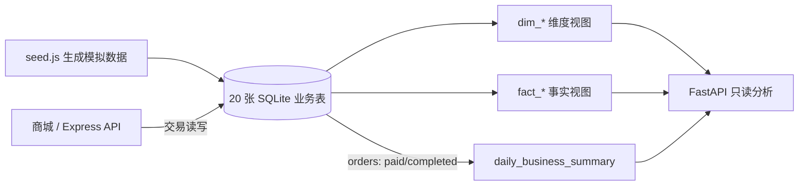

# 商城源表与分析视图映射

本文说明 `server/src/db.js` 如何把业务源表暴露为课程分析视图。这里的 `dim_*`、`fact_*` 和 `daily_business_summary` 都是 SQLite **即时视图**；仓库没有独立的清洗调度、物化仓库或增量 ETL 作业。生成器 `server/src/seed.js` 负责填充教学模拟数据。

## 数据链路

视图读取的是当前源表；FastAPI 的聚合结果另有 300 秒缓存，需 `POST /api/reload` 才能立即刷新。

## 维度视图

| 视图 | 来源 | 主键或粒度 | 说明 |
| --- | --- | --- | --- |
| `dim_date` | `orders`、`page_events`、`ads_spend`、`refunds` 的业务日期并集 | `date_id` | 按日期去重，提供年、月、星期与周末标记 |
| `dim_product` | `sku` + `spu` + `categories` | `sku_id` | 商品类目、品牌、价格、成本与供应商 |
| `dim_user` | `users` | `user_id` | 地区、注册渠道与会员等级 |
| `dim_campaign` | `campaigns` | `campaign_id` | 活动类型、渠道、目标人群、对照组标记与预算 |

## 事实视图

| 视图 | 来源 | 粒度 | 典型用途 |
| --- | --- | --- | --- |
| `fact_order` | `orders` | 一行一订单 | 付费状态筛选、GMV、客单与复购 |
| `fact_order_item` | `order_items` + `orders` | 一行一订单明细 | 商品贡献、毛利与购物篮；视图本身不筛订单状态 |
| `fact_traffic` | `page_events` | 一行一事件 | 会话漏斗与渠道行为 |
| `fact_ads_spend` | `ads_spend` | 一行一活动每日消耗 | 点击率、消耗与渠道效率 |
| `fact_coupon_use` | `user_coupons` + `coupons` | 一行一张用户券 | 发放和核销 |
| `fact_refund` | `refunds` + `orders` | 一行一退款 | 退款金额和原因 |
| `fact_fulfillment` | `shipments` + `orders` | 一行一包裹 | 配送时效与延迟 |
| `fact_inventory_movement` | `inventory_movements` | 一行一库存流水 | 补货与销售出库 |
| `fact_product_review` | `product_reviews` | 一行一评论 | 评分与体验标签 |

## 经营日报

`daily_business_summary` **直接查询 `orders`**，过滤 `status IN ('paid', 'completed')`，按 `date(orders.created_at)` 与 `orders.channel` 分组，输出订单数、买家数、GMV、优惠金额和客单价。它不是把全部 `fact_*` 视图二次汇总得到的表。

不同页面可能使用不同事实粒度。将订单行、包裹、退款等一对多数据连接到订单后再计算 GMV，会重复订单金额；应先按目标粒度汇总或使用订单视图。详细指标口径见[分析方法与指标口径](analysis-methodology.md)。

## 课程使用边界

- 经营日报可从 `daily_business_summary`、`fact_order` 与 `dim_product` 入手。
- 漏斗诊断使用 `fact_traffic`，但现有仪表盘分别统计各事件的独立会话，没有建立有序路径。
- 复购、分群与营销分析可从 `dim_user`、`fact_order`、`fact_coupon_use`、`fact_ads_spend` 和 `dim_campaign` 扩展；课程要求中的因果实验、分类器和后台管理模块不等于当前实现。
- 为保持历史指标可复现，避免直接改写 `orders`、`order_items`、`payments` 或历史 `page_events`。需要记录新增运营动作时可使用 `admin_action_logs` 或另建演示数据。
